# Mini Shopping App 🛒

A modern Flutter e-commerce application with Firebase integration, featuring Google authentication, real-time order management, and multiple payment options.

## ✨ Features

### 🔐 Authentication
- **Google Sign-In** integration
- **Firebase Authentication** with real-time auth state management
- **User Profile Management** with username setup
- **Secure Session Management**

### 🛍️ Shopping Experience
- **Product Catalog** with CSV data loading
- **Shopping Cart** with add/remove functionality
- **Real-time Cart Updates** with quantity management
- **Product Search & Filtering**

### 📍 Address Management
- **Dynamic Location Services** with country/state selection
- **Address Storage** in user profiles
- **Default Address Management**
- **Address Validation** with form validation

### 💳 Payment Integration
- **Multiple Payment Methods:**
  - UPI Payment (simulated)
  - Razorpay Integration (test mode)
  - Cash on Delivery (COD)
- **Payment Method Tracking** in user profiles and orders
- **Secure Payment Processing**

### 📦 Order Management
- **Real-time Order Creation** with auto-generated IDs
- **Order History** with status tracking
- **Order Details** with item breakdown
- **Delivery Address Management**

### 🔥 Firebase Integration
- **Firestore Database** for real-time data storage
- **User Collection** with addresses and payment preferences
- **Orders Collection** with complete order tracking
- **Security Rules** for data protection

## 📱 Screenshots

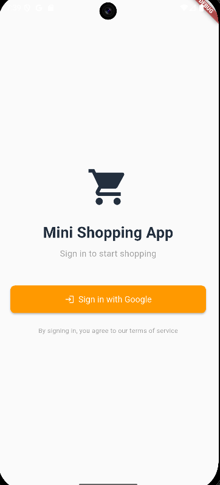 
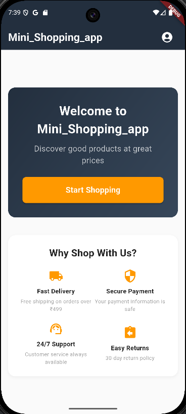
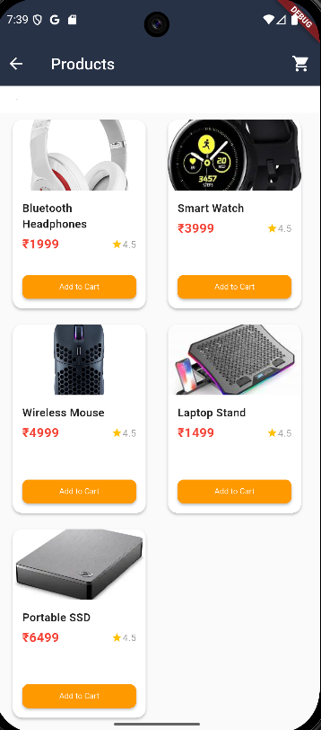
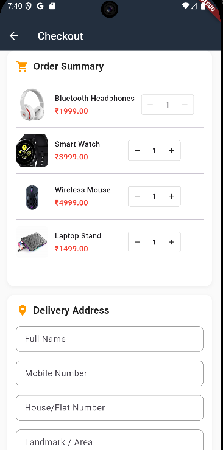
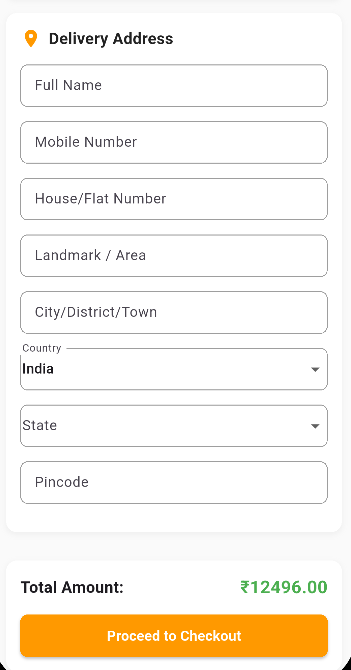
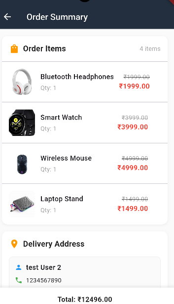
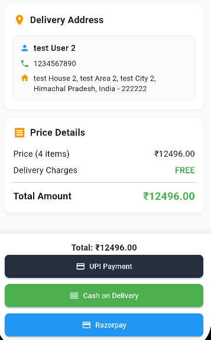
[](screenshots/ss12.png)
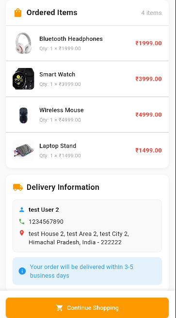
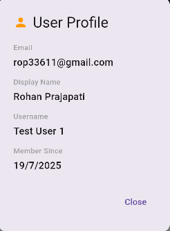
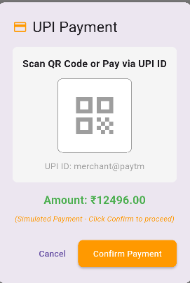
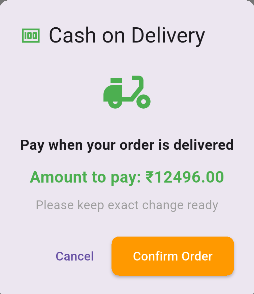
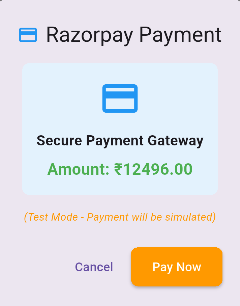

## 🚀 Getting Started

### Prerequisites
- Flutter SDK (latest stable version)
- Android Studio / VS Code
- Firebase account
- Razorpay account (for payment integration)

### Environment Setup

1. **Clone the repository**
   ```bash
   git clone <repository-url>
   cd mini_payment_app
   ```

2. **Install dependencies**
   ```bash
   flutter pub get
   ```

3. **Environment Variables Setup**
   ```bash
   # Copy the example environment file
   cp .env.example .env
   
   # Edit .env file and add your API keys
   nano .env
   ```

4. **Configure your .env file**
   ```env
   # Add your Razorpay API key
   rzp_api=rzp_test_your_api_key_here
   ```

5. **Firebase Setup**
   - Create a new Firebase project
   - Enable Authentication and Firestore
   - Download `google-services.json` for Android
   - Place it in `android/app/` directory

6. **Run the application**
   ```bash
   # For Android
   flutter run
   
   # For Web
   flutter run -d chrome
   ```

### 🔑 API Keys Required

- **Razorpay API Key**: Get from [Razorpay Dashboard](https://dashboard.razorpay.com/app/keys)
- **Firebase Configuration**: Set up through Firebase Console

### 📁 Project Structure

```
lib/
├── main.dart                    # App entry point
├── models/                      # Data models
├── screens/                     # UI screens
├── services/                    # Business logic
│   ├── firebase/               # Firebase services
│   ├── payment/                # Payment services
│   └── location_service.dart   # Location utilities
└── utils/                      # Helper utilities
```

## 🛠️ Development

### Adding New Payment Methods
1. Create a new service in `lib/services/payment/`
2. Implement the payment interface
3. Add to `payment_service.dart`
4. Update UI in checkout screens

### Database Schema
- **Users Collection**: User profiles and addresses
- **Orders Collection**: Order history and details
- **Products**: Loaded from CSV assets

## 🔒 Security

- API keys are stored in `.env` file (gitignored)
- Firebase security rules protect user data
- Payment processing uses secure tokens
- User authentication required for all operations
