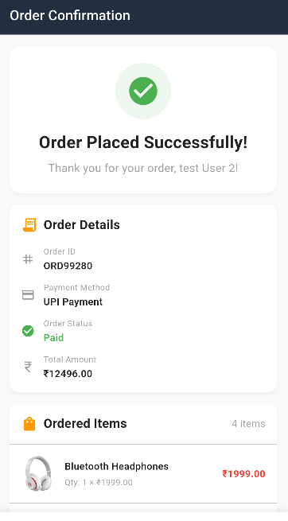

# Mini Shopping App 🛒

A modern Flutter e-commerce application with Firebase integration, featuring Google authentication, real-time order management, and multiple payment options.

## ✨ Features

### 🔐 Authentication
- **Google Sign-In** integration
- **Firebase Authentication** with real-time auth state management
- **User Profile Management** with username setup
- **Secure Session Management**

### 🛍️ Shopping Experience
- **Product Catalog** with CSV data loading
- **Shopping Cart** with add/remove functionality
- **Real-time Cart Updates** with quantity management
- **Product Search & Filtering**

### 📍 Address Management
- **Dynamic Location Services** with country/state selection
- **Address Storage** in user profiles
- **Default Address Management**
- **Address Validation** with form validation

### 💳 Payment Integration
- **Multiple Payment Methods:**
  - UPI Payment (simulated)
  - Razorpay Integration (test mode)
  - Cash on Delivery (COD)
- **Payment Method Tracking** in user profiles and orders
- **Secure Payment Processing**

### 📦 Order Management
- **Real-time Order Creation** with auto-generated IDs
- **Order History** with status tracking
- **Order Details** with item breakdown
- **Delivery Address Management**

### 🔥 Firebase Integration
- **Firestore Database** for real-time data storage
- **User Collection** with addresses and payment preferences
- **Orders Collection** with complete order tracking
- **Security Rules** for data protection

## 📱 Screenshots

 

